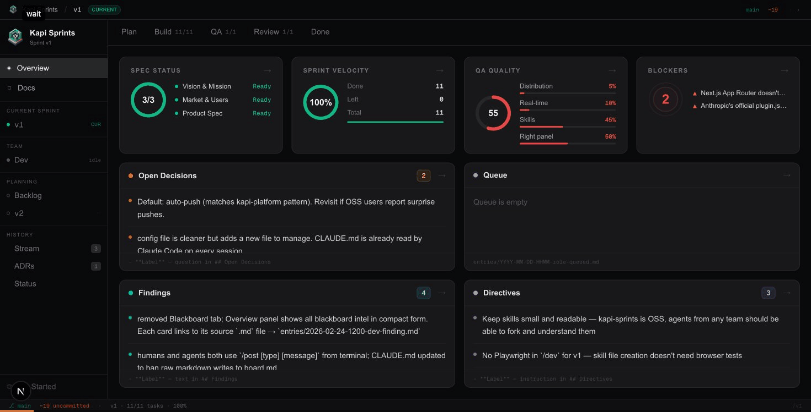
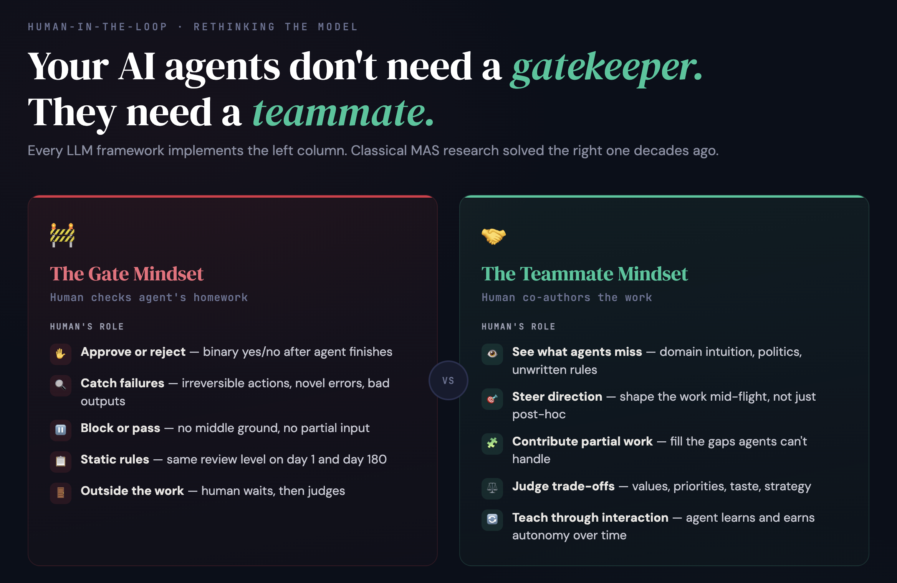
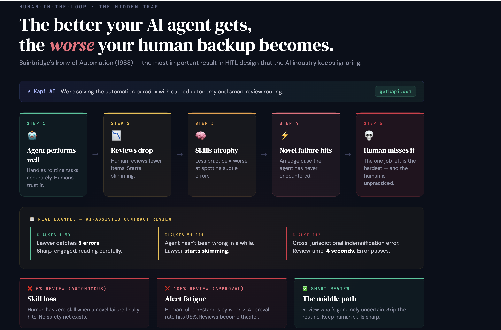

# Kapi Sprints

> **Multi-agent coordination for Claude Code human-agent teams.**

[](LICENSE)
[](https://nextjs.org)

Run multiple Claude Code terminals simultaneously — each as a specialist agent (PM, Dev, Test) — coordinated through a shared filesystem blackboard. Every agent reads the board, posts findings, and signals status. Humans stay in the loop on the decisions that matter.



---

## The Vision

Most teams are bolting AI onto how they already work. They add a copilot here, an agent there. Six months later the agents are ignored or causing problems — confidently wrong, silently drifting, reviewed so obsessively that humans are doing more work than before.

**The models aren't the problem. The coordination is.**

We're building toward something different: teams where AI agents announce availability, post findings, signal when stuck, and earn more autonomy as they prove reliable — all on a shared blackboard that every agent and human reads. Where humans review the 10% that genuinely needs human judgment, not 100% out of anxiety. Where context survives session boundaries and agents pick up exactly where they left off.

This is what an AI-native team looks like:

```
                    HUMAN PM
                       │
            ┌──────────┼──────────┐
            │          │          │
         reads       reviews    approves
         board       ~10% of    deploys
                     responses
                        │
         ┌──────────────┼──────────────────────┐
         │              │                      │
    PM AGENT      DEV AGENT(S)          TEST AGENT
    ─────────     ─────────────         ──────────
    /prd scope    /dev tasks            /test QA gate
    posts PRD     announces available   posts findings
    updates board  signals stuck        pushes to staging
    asks human     commits per-task     updates board
    for decisions  reads board
         │              │                      │
         └──────────────┼──────────────────────┘
                        │
                   BLACKBOARD
                   ──────────
                   board.md + entries/
                   agents read and write
                   dashboard renders live
```

kapi-sprints is the open-source infrastructure that makes this possible. Not a SaaS. Not an abstraction layer. A coordination system you run in your own repo, against your own files, in your own terminals.

---

## The Problem We're Solving



Every LLM framework treats human oversight as a gate — approve or reject after the agent finishes. Classical multi-agent research solved the right problem decades ago: humans as **teammates**, not gatekeepers. They steer mid-flight, fill gaps agents can't handle, and teach through interaction so agents earn more autonomy over time.



And there's a deeper trap. The better your agent gets, the worse your human backup becomes. Bainbridge's Irony of Automation (1983): as agents handle routine tasks reliably, humans review less, skills atrophy, and when a novel failure finally hits — the one case that needed a sharp human — nobody's sharp anymore.

kapi-sprints is built around both insights. Humans as teammates on the blackboard. Smart review routing so humans stay practiced on what genuinely needs them.

---

## The Three Systems

Getting to AI-native requires three things working together:

### 1. Blackboard — Shared State

Inspired by Hearsay-II (1980) and BB1 (1985): a shared knowledge store where multiple specialist agents contribute findings, read each other's state, and coordinate toward a common goal. No central orchestrator. No message passing. Just a shared surface.

```
Claude Code terminals          State files                 Dashboard
┌──────────────┐
│ Terminal 1   │──writes──▶  kapi/
│  /dev v1     │             ├── blackboard-live.yaml  ◀──reads──  localhost:8791
├──────────────┤             ├── entries/
│ Terminal 2   │──writes──▶  ├── sprints/v1/
│  /test v1    │             │   ├── tasks.md          ◀──reads──  Sprint progress
├──────────────┤             │   └── review.md         ◀──reads──  Review narrative
│ Terminal 3   │──writes──▶  ├── backlog.md
│  /prd v2     │             └── status.md
└──────────────┘
```

Agents speak to each other through typed signals — not chat, not tickets:

| Signal | Meaning |
|--------|---------|
| `available` | Agent initialized, ready for work |
| `finding` | Discovered something that changes direction |
| `decision` | Resolved an open question |
| `blocker` | Cannot proceed — needs human |
| `stuck` | Degraded but working — may need help |
| `handoff` | Passing ownership to next agent |
| `queue` | Idea to capture before it's lost |
| `idle` | Work complete, stepping back |

### 2. Sprint Workflow — Structured Cadence

A health-check → plan → build → QA → review cycle where each phase is a Claude Code skill. Context is never lost between sessions. Every sprint produces a complete paper trail.

```
/resume    → "Where was my head?" (context recovery after time away)
/preflight → Go/no-go: git, build, architecture drift, UX
/scorecard → Honest health percentages — no optimism, just reality
/prd       → Scope negotiation. PRD + tasks written. Board updated.
/dev       → Pick task → TDD → commit → repeat. Board updated.
/test      → Build + types + lint + code review → push to staging
/walkthrough → Per-task narrative of what was built and why
/checkpoint → End of day. Intent captured for tomorrow's agents.
```

### 3. HITL Protocol — Earned Autonomy

Not a veto button. A trust protocol. Based on Sheridan's 10-level autonomy model (1978), agents should move along the control spectrum as they earn trust:

```
Level 4: Agent proposes, human decides        ← /prd scope negotiation
Level 5: Agent executes, human can veto first ← approval gate
Level 6: Agent executes, posts to board       ← blackboard signals
Level 7: Agent acts, human reads board        ← autonomous with audit trail
```

Agents earn more autonomy over time as they demonstrate reliability:

```
Review rate
  100% │▓▓▓▓▓▓▓▓   ← New agent (Day 1)
       │        ▓▓▓▓▓
   75% │             ▓▓▓▓
       │                 ▓▓▓
   25% │                    ▓▓▓▓▓▓▓▓▓▓▓▓
    5% │─────────────────────────────────▷ baseline
       └──────────────────────────────────
        Day 1    Week 2    Month 1   Month 6
```

Every human decision — approve, reject, edit — is a labeled training example. Over time, the team's review burden drops. Agents improve. Autonomy is earned, not assumed.

→ **[Read the full vision](docs/concepts/vision.md)**

---

## Quick Start

```bash
git clone https://github.com/kapihq/kapi-sprints.git
cd kapi-sprints
npm install
npm run dev
# → http://localhost:8791
```

Open the dashboard. You'll see Sprint v1 — the sprint that built kapi-sprints itself.

---

## Live Blackboard Channel

The dashboard supports **live multi-agent coordination** via a blackboard server and MCP channel shim. Multiple Claude Code sessions connect to a shared YAML blackboard — every write broadcasts to all agents in real time.

```
                  ┌─────────────────────────┐
                  │   BLACKBOARD SERVER      │  ← single process (port 8790)
                  │   blackboard/server.ts   │
                  │                          │
                  │  • Owns blackboard YAML  │
                  │  • Agent callback registry│
                  │  • Broadcasts on change  │
                  └─────┬───────┬───────┬────┘
                        │       │       │
                   HTTP │  HTTP │  HTTP │  (broadcast notifications)
                        │       │       │
                  ┌─────┴──┐ ┌──┴────┐ ┌┴───────┐
                  │ SHIM A │ │SHIM B │ │ SHIM C │  ← MCP stdio proxies
                  └───┬────┘ └──┬────┘ └───┬────┘
                   stdio     stdio      stdio
                      │         │          │
                  Claude A  Claude B   Claude C
                      │         │          │
                      └─────────┴──────────┘
                               │
                        Dashboard (Next.js)
                        ws://localhost:8790/ws
```

### Setup

**Prerequisites**: [Bun](https://bun.sh) runtime (`curl -fsSL https://bun.sh/install | bash`)

**Option A — Per-project** (`.mcp.json` already included):

Just start Claude Code from the repo directory. The `.mcp.json` configures the shim automatically.

**Option B — Global** (works from any directory):

```bash
claude mcp add --scope user blackboard-channel -- \
  bun /path/to/kapi-sprints/blackboard/shim.ts
```

This registers the channel in `~/.claude/settings.json`. Every Claude Code session gets the blackboard tools — no per-project config needed.

### How It Works

1. Claude Code spawns the shim as an MCP server on startup
2. The shim auto-starts the blackboard server on port 8790 if not already running
3. Each shim registers a callback port with the server
4. Any `write_to_blackboard` call triggers a broadcast to ALL connected shims
5. Each shim delivers a `<channel>` notification to its Claude session
6. The Next.js dashboard connects via WebSocket for live updates

You don't need to start anything manually — the shim handles server lifecycle automatically.

### MCP Tools

| Tool | Description |
|------|-------------|
| `read_blackboard` | Read the full YAML state (or a specific section) |
| `write_to_blackboard` | Write to a dot-path (e.g. `agents.dev`), notifies all agents |

### Server Endpoints

| Endpoint | Method | Description |
|----------|--------|-------------|
| `/state` | GET | Raw JSON state |
| `/agents` | GET | Registered agent callbacks |
| `/register` | POST | Shim registers callback port |
| `/unregister` | POST | Shim deregisters on shutdown |
| `/read` | POST | Read blackboard state |
| `/write` | POST | Write + broadcast to all agents |
| `/directive` | POST | Post a directive (from dashboard or human) |
| `/ws` | WS | Live WebSocket updates (dashboard) |

### File Structure

```
blackboard/
├── server.ts     # Shared singleton — owns YAML, broadcasts to all agents
└── shim.ts       # Per-session MCP proxy — spawned by Claude Code
```

---

## What's Inside

### Claude Code Skills (`.claude/skills/`)

| Skill | What it does |
|-------|-------------|
| `/prd v1` | Plan a sprint interactively — reads backlog + board, brainstorms scope, writes `prd.md` + `tasks.md` |
| `/dev v1` | Implement tasks with TDD — posts `available` to team sidebar, picks next task, commits per task |
| `/test v1` | QA gate — build + type check + lint. Stops on first failure. Pushes to staging. |
| `/post` | Post to the blackboard — `finding`, `decision`, `blocker`, `available`, `handoff`, `queue` |

### Dashboard

| View | What you see |
|------|-------------|
| **Overview** | Spec status, sprint velocity, QA quality, blockers, decisions, findings, queue |
| **Build** | Task blocks with checkboxes — click to toggle, persists to `tasks.md` |
| **QA** | Test results and code review output |
| **Review** | Sprint walkthrough narrative |
| **Stream** | Filterable timeline of all blackboard entries |
| **Docs** | Markdown + Mermaid rendering of any file in `docs/` |

### File Structure

```
kapi/                          ← Live sprint state
├── blackboard-live.yaml       ← Blackboard (managed by server)
├── entries/                   ← One .md per decision/finding/milestone
├── sprints/                   ← Active sprint files
├── agents/                    ← Agent profile .md files
├── backlog.md                 ← Unscheduled ideas
└── status.md                  ← What works, what doesn't

docs/                          ← Documentation
├── concepts/                  ← Vision, blackboard pattern, principles
├── foundation/                ← Product definition
├── design/                    ← Architecture decisions
├── history/                   ← Archived sprint records
└── references/                ← MAS research & book
```

---

## Concepts

| Guide | Pillars | What it covers |
|-------|---------|---------------|
| [Vision: 16 Pillars in Practice](docs/concepts/vision.md) | All 16 | The full mapping of classical MAS research to kapi-sprints |
| [The Blackboard Pattern](docs/concepts/blackboard.md) | 1, 4, 5, 8 | Shared state, result sharing, communication, three memory tiers |
| [Backwards Build](docs/concepts/backwards-build.md) | 16 | Start from done. Every intermediate state is deployable. |
| [Human-in-the-Loop](docs/concepts/hitl.md) | 9, 10, 12, 13 | Earned autonomy, trust, learning, governance |

---

## Configuration

Edit `project.config.ts` to brand the dashboard for your project:

```typescript
export const PROJECT = {
  name: 'My Project',
  short: 'mp',
  description: 'One-line description',
  repo: 'https://github.com/you/your-repo',
}
```

---

## Roadmap

- [ ] Real-time file watching (SSE — dashboard updates within 1-2 seconds of any `.md` change)
- [ ] CLI packaging (`npx kapi-sprints dashboard`)
- [ ] Claude Code plugin marketplace distribution
- [ ] `/resume` — session recovery: "where was my head?"
- [ ] `/checkpoint` — session debrief + board pruning
- [ ] `/sprint init` — Foundation Gate as a Claude Code command
- [ ] `/scorecard` — config-based quality layer auditing
- [ ] Per-category competence tracking (autonomy ramp implementation)
- [ ] Shadow mode infrastructure (earn autonomy before acting autonomously)
- [ ] Active learning loop (human decisions → labeled dataset → prompt optimization)

---

## Built by Kapi

This is how we build [Kapi](https://getkapi.com) — an AI agent platform where blueprints ship all 8 layers: UI, Graph, Integrations, Knowledge, Memory, HITL, Evals, and Observability.

The blackboard pattern and HITL protocol you see in kapi-sprints are the same coordination model that powers Kapi's multi-agent orchestration. Teams who use kapi-sprints are learning the methodology firsthand — and building exactly the kind of AI-native workflow that makes Kapi's enterprise features make sense.

---

## Contributing

Contributions welcome. Read [docs/concepts/principles.md](docs/concepts/principles.md) first — the design philosophy shapes all decisions.

```bash
git checkout -b feat/your-feature
npm run dev    # test locally
npm run build  # must pass
# Submit PR
```

---

## License

Apache 2.0 — see [LICENSE](LICENSE) and [NOTICE](NOTICE)

Built by [Kapi AI](https://getkapi.com)
